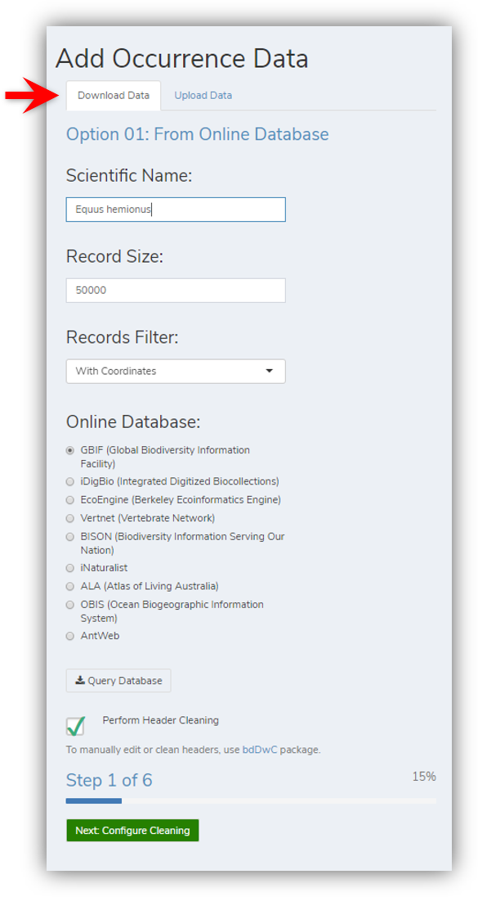
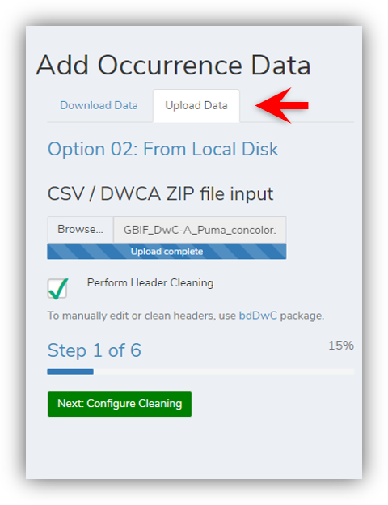
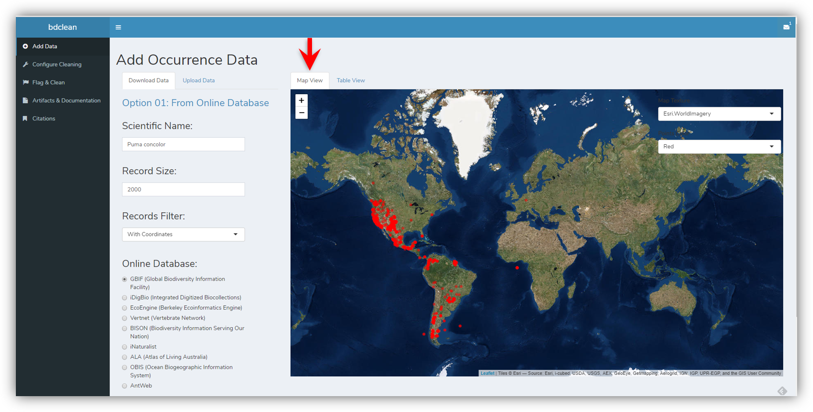
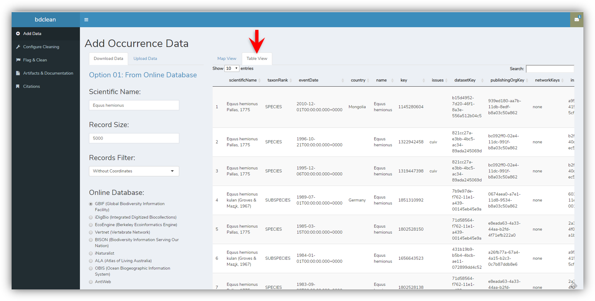

# Add data

***

## Directly download data to the app

**OR**

## Upload data from a local file

The app supports CSV files and DwC-A zip files (Darwin Core Archive)

## Map view

## Table view

