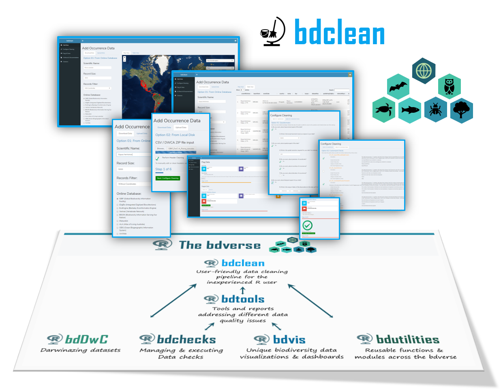
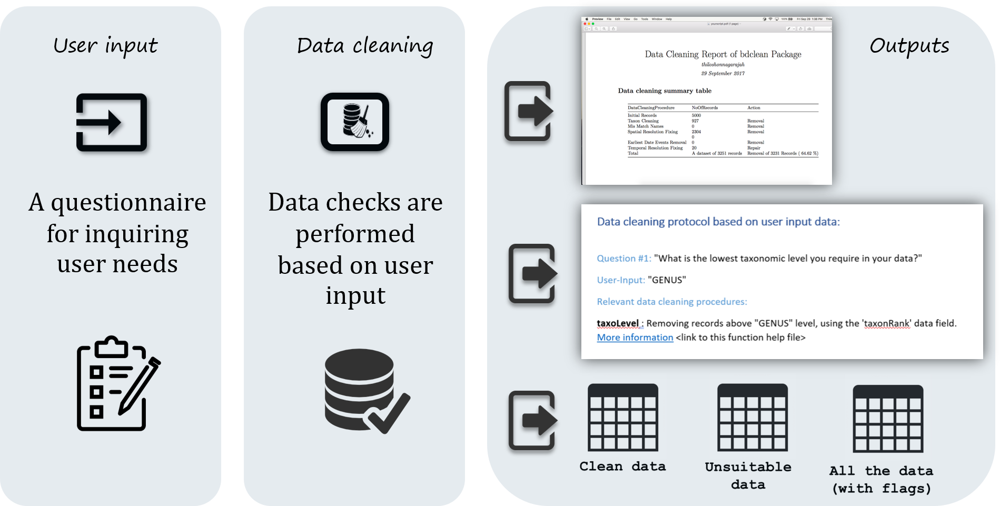
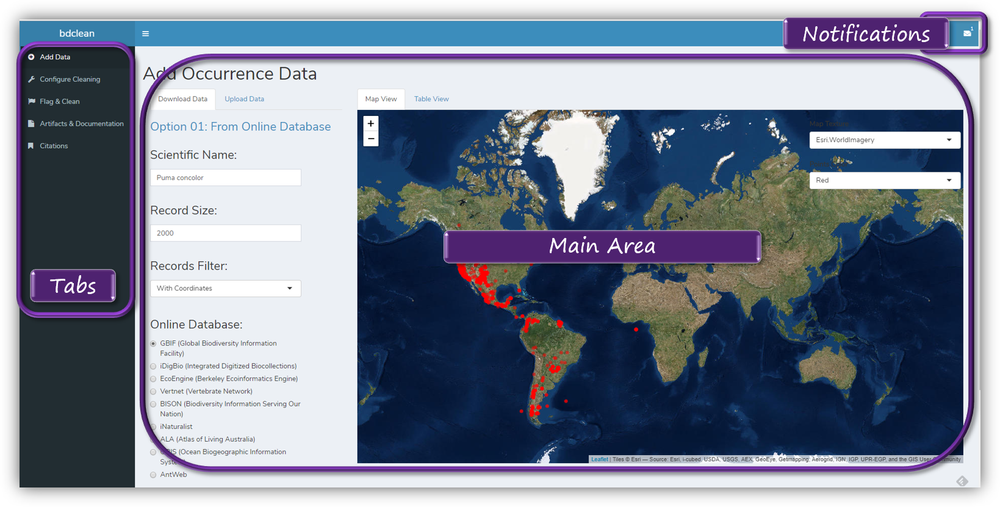

--- 
title: "`bdclean` User Guide"
author: "Authors: Tomer Gueta and Thiloshon Nagarajah"
date: "2018-09-05"
site: bookdown::bookdown_site
documentclass: book
bibliography: [bib/Veiga-2017.bib, bib/Chapman-2005.bib, bib/Gueta-2016.bib]
biblio-style: apalike
link-citations: yes
github-repo: bd-R/bdclean-guide
url: 'http\://bd-r.github.io/bdclean-guide/'
description: "A user-friendly data cleaning app for the inexperienced R user"
---

# Introduction {-}

`bdclean` is a user-friendly data cleaning Shiny app for the inexperienced R user. It provides features to manage complete workflow for biodiversity data cleaning, from uploading the data; gathering input from the user, in order to adjust cleaning procedures; perform the cleaning; and finally, generating various reports and several versions of the data.
`bdclean` is part of [The bdverse](https://bd-r.github.io/The-bdverse/index.html){target="_blank"} -- a collection of tools, that form a general framework for facilitating biodiversity science in R.

#### bdclean's concept {-}

bdclean workflow is comprised of three distinct mechanisms, user input, data cleaning and outputs. In most R packages this basic workflow (i.e. input; processing; output) operates via an R function. Functions are fundamental building blocks of R, and usually focus on very specific task. Users must understand and supply the function with its mandatory arguments (e.g. data in the specified format, setting of various function variables). Thus, in order to create a specific workflow, users must write an R script, which requires reasonable programing skills. bdclean avoids all that by creating a user-friendly Shiny app with questionnaire that collects the necessary user input.

#### App overview{-}

#### Fundings {-}

 

* [The GSoC project idea page](https://github.com/rstats-gsoc/gsoc2018/wiki/bdclean%3A-User-friendly-biodiversity-data-cleaning-pipeline target="_blank")

